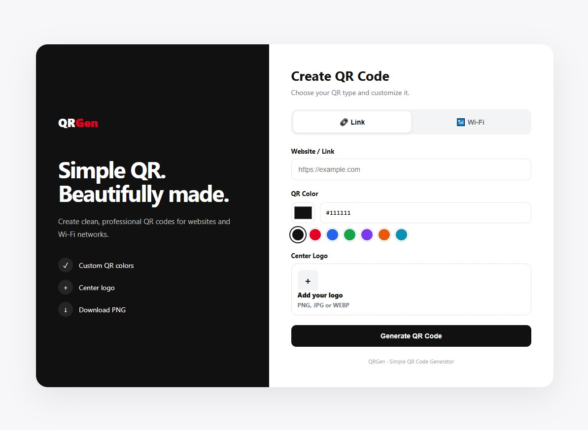

````markdown
# QRGen — Link & Wi-Fi QR Code Generator

A clean, modern, and responsive **QR Code Generator** built with HTML, CSS, and JavaScript.

QRGen allows users to generate QR codes for **web links and Wi-Fi networks**, customize the QR color, add a center logo, and download the finished QR code as a PNG image.

---

## 📸 Screenshot

<!-- Replace this image with your actual screenshot -->



> **Tip:** Create a folder named `screenshots` in your project and place your screenshot inside it as `qrgen-preview.png`.

Example:

```text
project/
│
├── index.html
├── README.md
│
└── screenshots/
    └── qrgen-preview.png
````

---

## ✨ Features

### 🔗 Link QR Code

Generate a QR code from any website or URL.

Example:

```text
https://example.com
```

If you enter:

```text
example.com
```

the application automatically converts it to:

```text
https://example.com
```

---

### 📶 Wi-Fi QR Code

Generate a QR code that allows users to connect to a Wi-Fi network by scanning it with their phone.

Supported security types:

* WPA / WPA2 / WPA3
* WEP
* No Password

You can also specify whether the Wi-Fi network is hidden.

Example:

```text
Wi-Fi Name: MyHomeWiFi
Password: MyPassword123
Security: WPA / WPA2 / WPA3
Hidden: No
```

---

## 🎨 QR Color Customization

Choose from several predefined QR colors:

* Black
* Red
* Blue
* Green
* Purple
* Orange
* Cyan

You can also select a completely custom color using the color picker.

The QR background remains white to maintain good contrast and scanning reliability.

---

## 🖼️ Center Logo

Add your own logo to the center of the QR code.

Supported formats:

* PNG
* JPG / JPEG
* WEBP

The QR code uses high error correction to help maintain scanability when a logo is placed in the center.

For best results, use:

* Square logos
* Transparent PNG files
* Simple logos
* High-resolution images

---

## 📥 Download QR Code

Generated QR codes can be downloaded directly as a PNG image.

Example filename:

```text
qr-code.png
```

This makes the QR code easy to use for:

* Websites
* Business cards
* Posters
* Product packaging
* Menus
* Wi-Fi signs
* Social media
* Marketing materials
* Printed stickers

---

## 📋 Copy Content

The **Copy Content** button allows users to copy the generated QR content.

For a Link QR, it copies the URL.

For a Wi-Fi QR, it copies the Wi-Fi configuration string.

---

## 📱 Responsive Design

QRGen works on:

* Desktop
* Laptop
* Tablet
* Mobile phones

The interface automatically adjusts to smaller screen sizes.

---

## 🖥️ User Interface

The interface uses a simple two-section layout.

### Desktop

```text
┌─────────────────────────────────────────────────────┐
│                                                     │
│   QRGen                         Create QR Code       │
│                                                     │
│   Simple QR.                   ┌───────────────┐   │
│   Beautifully made.            │ 🔗 Link       │   │
│                                │ 📶 Wi-Fi      │   │
│   Create clean QR codes        └───────────────┘   │
│   for websites and Wi-Fi.                          │
│                                Website / Link       │
│                                ┌───────────────┐   │
│                                │ example.com   │   │
│                                └───────────────┘   │
│                                                     │
│                                QR Color             │
│                                ● ● ● ● ● ● ●       │
│                                                     │
│                                Center Logo          │
│                                                     │
│                                [ Generate QR ]      │
│                                                     │
└─────────────────────────────────────────────────────┘
```

---

## 🛠️ Technologies

QRGen is built using:

* HTML5
* CSS3
* JavaScript
* QR Code Styling

### QR Code Library

This project uses:

**QR Code Styling**

```html
<script src="https://cdn.jsdelivr.net/npm/qr-code-styling@1.9.2/lib/qr-code-styling.js"></script>
```

---

## 📁 Project Structure

The project can be kept extremely simple:

```text
QRGen/
│
├── index.html
├── README.md
│
└── screenshots/
    └── qrgen-preview.png
```

Because the application is contained in a single HTML file, no build system is required.

---

## 🚀 Getting Started

### 1. Download or clone the project

```bash
git clone https://github.com/YOUR_USERNAME/qrgen.git
```

Then enter the project folder:

```bash
cd qrgen
```

---

### 2. Open the application

Simply open:

```text
index.html
```

in your web browser.

No PHP server or database is required.

---

## 🌐 Run with VS Code

If you are using Visual Studio Code, you can use the **Live Server** extension.

1. Open the project folder in VS Code.
2. Open `index.html`.
3. Right-click the file.
4. Select **Open with Live Server**.

The application will open in your browser.

---

## 🔐 Privacy

QRGen generates the QR code directly in the browser.

No backend or database is required.

The URL, Wi-Fi information, and uploaded logo are processed locally by the webpage.

> Avoid sharing or publishing Wi-Fi passwords in places where unauthorized people could access them.

---

## ⚠️ QR Code Scanning Tips

For the best scanning performance:

### Recommended

* Use a white background.
* Use a dark QR color.
* Keep sufficient white space around the QR.
* Don't make the center logo too large.
* Use a high-resolution logo.
* Test the QR code with multiple phones before printing.

### Avoid

* Very light QR colors.
* Low contrast combinations.
* Extremely large center logos.
* Blurry QR images.
* Cropping the white margin around the QR.

---

## 🎯 Use Cases

QRGen can be used for many applications.

### Business

```text
Website
Google Maps
Social Media
Business Card
Contact Page
Online Store
```

### Restaurants

```text
Digital Menu
Online Ordering
Restaurant Website
Feedback Form
```

### Wi-Fi

```text
Home Wi-Fi
Hotel Wi-Fi
Restaurant Wi-Fi
Office Wi-Fi
Events
Guest Networks
```

### Marketing

```text
Product Packaging
Posters
Flyers
Business Cards
Promotional Materials
```

---

## 🎨 Design

QRGen follows a minimal design philosophy inspired by modern payment and fintech interfaces.

Design characteristics include:

* Clean layout
* Rounded UI elements
* High contrast
* Minimal colors
* Simple navigation
* Large QR preview
* Mobile-friendly interface

---

## 🔮 Future Improvements

Possible future features include:

* [ ] vCard / Contact QR
* [ ] Email QR
* [ ] Phone number QR
* [ ] SMS QR
* [ ] Text QR
* [ ] WhatsApp QR
* [ ] Google Maps QR
* [ ] Social media QR
* [ ] UPI / payment QR
* [ ] SVG download
* [ ] PDF download
* [ ] QR size control
* [ ] QR margin control
* [ ] Gradient QR colors
* [ ] Custom corner styles
* [ ] QR templates
* [ ] QR history
* [ ] Dark mode
* [ ] Multiple logo styles

---

## 📄 License

This project is free to use and modify for personal or commercial projects.

You can customize the UI, branding, colors, and features according to your requirements.

---

## 👨‍💻 Author

**QRGen**

A simple and modern QR code generator for links and Wi-Fi.

---

## ⭐ Support

If you find this project useful, consider giving it a ⭐ on GitHub.

```text
QRGen
Simple QR. Beautifully made.
```

```
```
